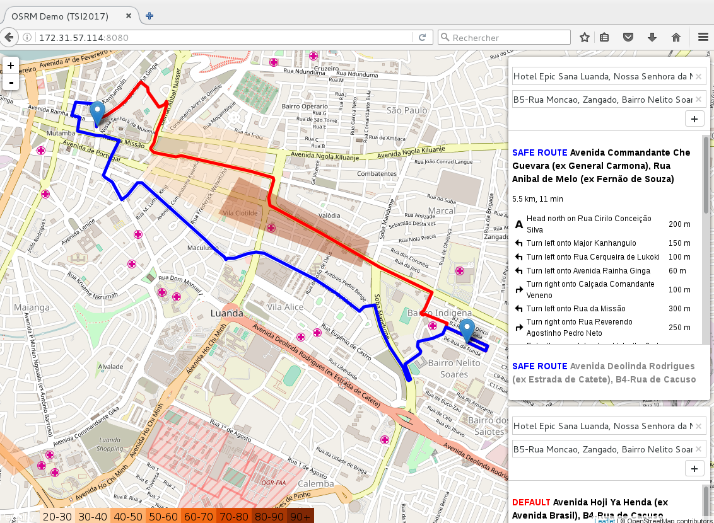

# Routing-as-a-Service

Demonstration of a frontend (using Leafmap Routing Machine) connected to two local OSRM servers. The goal is to experiment on dangerous zones seen as penalty zones by the OSRM engine.

See below:
* red route is default (optimization by speed)
* blue route is safest (optimization by avoiding penalty zones)

