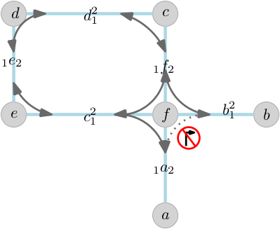
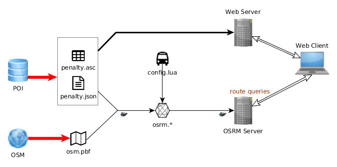
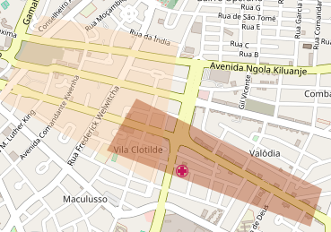
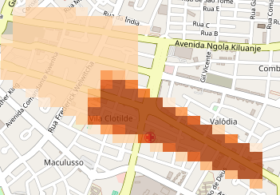
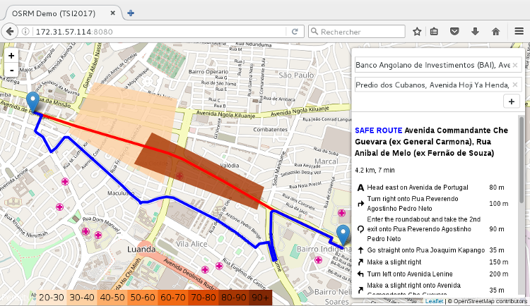

# Study report on OSRM as a routing engine

Objectives:

* setup of a local routing server
* use of danger zone (ie zone to avoid)
* connection to a client server 
* comparison of regular routing and *smart* routing

## Overall Project requirements

Not specific to the routing engine :

* Open source, licence authorizing "private" use
* Global coverage or at least specific cities/areas
* Vehicle constraints (height, weight, ...)
* Via points and Avoid areas
* Points of interest
* Combining private data and public data (OSM)
* Communication with handlheld devices (send route)

## Why OSRM ?

[OSRM](http://project-osrm.org/) is an active an open source effort to provide routing capabilities from OSM data. Since our main source of data is OSM, it does make sense to stay in the same environment.

### Graph representation

The quality of a routing depends on how accurately it represents the reality (one-way roads, intersections, etc.). Plus, we want to take into account our own data (the warning zones).

#### Naive view of a graph of roads

A road network is represented as a graph where:

* the entities (ie **nodes**) are intersections
* the roads are connections (ie **edges**)
* **weights** on edges represent the cost to traverse it (it can depends on the mode of transport, ie bike vs car)

More edges are necessary to model a curved road (this would represent the geometry).

The simplest algorithm is **[Dijkstra’s Algorithm](http://en.wikipedia.org/wiki/Dijkstra%27s_algorithm)** which computes only the shortest path (ie with the minimum weight). It fails when there is an intersection with one-way roads.

#### OSRM view

A road network is represented by an *edge-expanded* model. Basically, **nodes** are roads and **edges** are valid paths. This takes into account the "intersection with one-ways" problem.



This king of graph is about 4 times larger than the naive one.

It can take into account a cost associated with road connections. For instance, it can minimise turns, stop signs, traffic signals... (which would be useful for two-wheeled vehicles)

> See [Mapbox blog](https://www.mapbox.com/blog/smart-directions-with-osrm-graph-model/) for a description of the strenght of this model.
> See [OSRM Graph representation](https://github.com/Project-OSRM/osrm-backend/wiki/Graph-representation) for an explanation of how it is done in OSRM

#### Implementation of warning zones

Each road / intersections has a weight depending on:

* speed limits
* quality of road
* topography of the network ("perpendicular turn"), etc...
* topography of the area (slopes for instance)

This flexibility allows the construction of a graph suited for either cars, bikes, pedestrians, trucks, etc ... where high slopes will not be proposed to a biker for instance.

The computation of the weights is done via a *script* than can be relatively easy to modify. Since it is a script, it is not necessary to rebuild the OSRM engine for each change of our weight computation.

The format of data used for the weight (like *mnt* data) is a simple matrix:
```
1 10 50 10 15
1 25 35 25 5
```
Each value will cover a rectangular area limited by a min/max set of coordinates (lat, lon).

## Our setup

The setup has so far been deployed on a single machine with a Debian OS. OSRM is *dockerised*.

The input data from OSM is retrieved via [geofabrik](http://download.geofabrik.de/) in **pbf** (*protocol buffer format* which is a binary format preferable to *xml*, in size of the archive). 

The warning zones are fake for now and only consist of a "big" central zone in Luanda.

Each time, either the OSM data or the warning zones are updated, the reconstruction of the graph is needed. This takes several minutes and use a lot of memory. This is the most intensive task.

Then a local OSRM server can be launched, along with a web server (for the warning zones). For demonstration purposes, we also have a "regular" OSRM server using graph optimized for fastest route for cars.

### Overall view




### Warning zones 

For a simple integration into OSRM, the warning zones are implemented as a matrix of values ranging from 0 to 100, where 100 is the maximum penalty applicable to an *arc*.

The warning zones depicted here in vector :

are changed into a pixellated version (the precision of the pixelisation can be improved at no cost for the OSRM engine, it only takes more time to display this layer on the demonstrator).



### Simple web frontend 

The temporary frontend is based on [Leafmap Routing Machine](http://www.liedman.net/leaflet-routing-machine/), also an open source and active project.

The picture below shows both routes (with same origin and destination):

* the red one is oblivious of the warning zones ("default" OSRM engine).
* the blue one tends to avoid warning areas, even if this a cost in time and distance. 



The user can dynamically choose an origin and adestination, add new waypoints and see both proposed routes.

Warning zones can be displayed as pixellated data or exactly as they where defined (vector data). 

## Dependencies / Code components

Data:

* OSM (*soon* : local OSM data server for tiles and vector aka road/POI data)
* Warning zones local database

Used (as services / libraries):

* OSRM graph generator (in a docker file - nothing to setup on the target machine)
* OSRM server (docker)
* Leafmap Routing Machine / leafmap : web client

New code:

* One program for:
	* Warning Zones to penalty matrix generator (for OSRM)
	* Scripts (for setup of OSRM graph, OSRM server)
	* Copy file into relevant folder for services
* Scripts to launch services (will be used for continuous deployment, like "what to do when there is a change in the warning zones) 
* One function in a script for taking into account the warning zones


