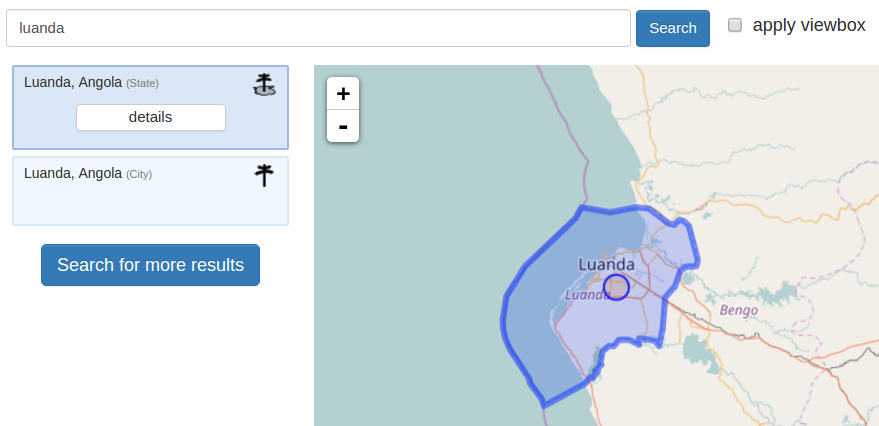
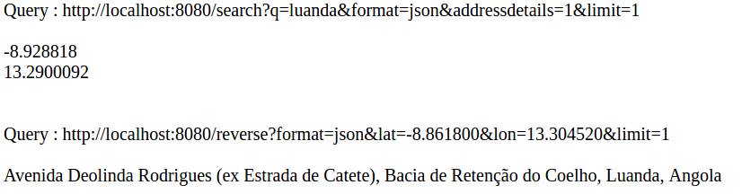

# OSM - Nominatim #

Source : [http://wiki.openstreetmap.org/wiki/Nominatim](http://wiki.openstreetmap.org/wiki/Nominatim)

Nominatim is a tool to search OSM data by name and address and to generate synthetic addresses of OSM points (reverse geocoding).

Policies : [https://operations.osmfoundation.org/policies/nominatim/](https://operations.osmfoundation.org/policies/nominatim/)

## Internet way ##

With the address to have information (of latitudes and longitudes) :
Parameters

> http://nominatim.openstreetmap.org/search?<params>
> http://nominatim.openstreetmap.org/search/<query>?<params>

Examples

> http://nominatim.openstreetmap.org/search/gb/birmingham/pilkington%20avenue/135?format=xml&polygon=1&addressdetails=1
> http://nominatim.openstreetmap.org/search/Unter%20den%20Linden%201%20Berlin?format=json&addressdetails=1&limit=1&polygon_svg=1

With GPS coordinates for the address :
Parameters

> http://nominatim.openstreetmap.org/reverse?<query>

Example

> http://nominatim.openstreetmap.org/reverse?format=xml&lat=52.5487429714954&lon=-1.81602098644987&zoom=18&addressdetails=1

## Install ##

Source : [http://wiki.openstreetmap.org/wiki/Nominatim/Installation](http://wiki.openstreetmap.org/wiki/Nominatim/Installation)

Prerequisites
+ GCC compiler
+ PostgreSQL (+ configuration)
+ Proj4
+ GEOS
+ PostGIS
+ PHP5
+ PHP-pgsql
+ PEAR::DB
+ wget
+ boost
+ osmosis
+ CentOS

A minimum of 2GB of RAM is required

## Docker ##

We want to be at the maximum independent of the internet and transportable.
We need to keep the data of the regions we are interested in and update them after a given period, like a month.

### Tested images
https://github.com/mediagis/nominatim-docker

We tryed to run these docker image. With some configurations (two lines replaced), we were able to set nominatim geocoding on Angola area. The data for nominatim come from [the geofabrick](http://download.geofabrik.de/).

As this image fulfill all the requirements for our usage of nominatim, we created a php-server side page to query nominatim service and extract :
- lat/lon if we send an address
- address if we send a lat/lon

Example :

Check our tool [here](test_request_nominatim.php).

### Others images
https://github.com/helvalius/nominatim-docker

We tried this docker image too. The result is the same : a working nominatim service. Because of the number of pull on docker hub, and because of the number of respecting issues on each github repository, we decided to use the [mediagis docker image](https://github.com/mediagis/nominatim-docker).

Lot of [images](https://hub.docker.com/search/?isAutomated=0&isOfficial=0&page=1&pullCount=0&q=nominatim&starCount=0) on hub.docker.com
